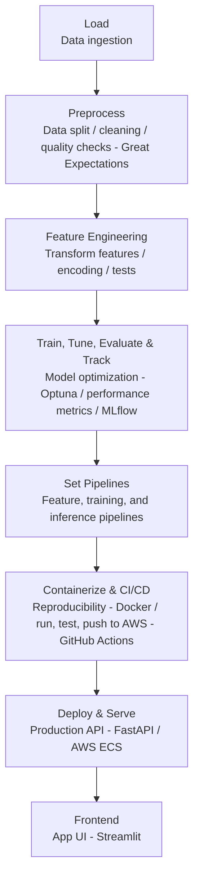

## Problem Statement

## Why Housing Price Prediction Matters

Real estate markets require accurate pricing models for buyers, sellers, and
investors to make informed decisions in a volatile market.

## Dataset & Scope

US housing dataset with geographic, demographic, and economic features
spanning multiple years of market data.

## Link to dataset:
https://www.kaggle.com/datasets/shengkunwang/housets-dataset

Project Goal

Build a production-ready system with automated pipelines, monitoring, and
scalable cloud infrastructure to predict housing prices in the US.

# ML Engineering Pipeline

Complete workflow from raw data to production deployment with automated orchestration and monitoring.



## Stages

1. **Load** — Data ingestion
2. **Preprocess** — Data split, data cleaning, data quality checks (Great Expectations)
3. **Feature Engineering** — Transform features, encoding, tests
4. **Train, Tune, Evaluate & Model Tracking** — Model optimization (Optuna), performance metrics, model tracking (MLflow)
5. **Set Pipelines** — Feature, training, and inference pipelines
6. **Containerize & CI/CD** — Reproducibility (Docker), run/test/push to AWS (GitHub Actions)
7. **Deploy & Serve** — Production API (FastAPI) / AWS ECS
8. **Frontend** — App UI (Streamlit)

---

# Table of Contents

1. [Repository Map](#repository-map)
2. [Getting Set Up On Your Machine](#getting-set-up-on-your-machine)
3. [Part A — The Notebooks (Research Phase)](#part-a--the-notebooks-research-phase)
4. [Part B — From Notebook to Production Code ("Modularization")](#part-b--from-notebook-to-production-code-modularization)
5. [Part C — Running the Full Pipeline End-to-End](#part-c--running-the-full-pipeline-end-to-end)
6. [Part D — Tests](#part-d--tests)
7. [Part E — Inference Pipeline Deep Dive](#part-e--inference-pipeline-deep-dive)
8. [Part F — Cloud Setup on AWS](#part-f--cloud-setup-on-aws)
9. [Part G — The FastAPI Service](#part-g--the-fastapi-service)
10. [Part H — Dockerizing Both Services](#part-h--dockerizing-both-services)
11. [Part I — The Streamlit Dashboard (UI)](#part-i--the-streamlit-dashboard-ui)
12. [Part J — CI/CD with GitHub Actions](#part-j--cicd-with-github-actions)
13. [Part K — Experiment Tracking with MLflow](#part-k--experiment-tracking-with-mlflow)
14. [Part L — Data Quality & Validation](#part-l--data-quality--validation)
15. [Known Issues & Troubleshooting](#known-issues--troubleshooting)
16. [Full Command Cheat-Sheet](#full-command-cheat-sheet)
17. [Glossary for Beginners](#glossary-for-beginners)

---

# Repository Map

A plain-English guide to every folder before we go file-by-file later.

```
Housing_regression_MLE/
├── data/                      # Raw, cleaned, and feature-engineered CSVs (not in git — S3-synced)
│   ├── raw/                   #   original + time-split data (train.csv, eval.csv, holdout.csv)
│   ├── processed/             #   cleaned + feature-engineered CSVs, ready for a model
│   └── predictions/           #   monthly batch prediction outputs
├── models/                    # Trained model + encoder pickle files (xgb_best_model.pkl, etc.)
├── mlruns/                    # MLflow's local experiment-tracking database (auto-created)
├── configs/                   # YAML config files (currently empty placeholders — see Part L)
├── notebooks/                 # Jupyter notebooks — the "research lab" (00 through 07)
├── src/                       # Production Python code — the "factory" (see Part B)
│   ├── feature_pipeline/      #   load → preprocess → feature-engineer raw data
│   ├── training_pipeline/     #   train, tune, evaluate the model
│   ├── inference_pipeline/    #   turn new raw data into predictions
│   ├── batch/                 #   scheduled/bulk prediction runner
│   └── api/                   #   the FastAPI web service
├── tests/                     # Automated tests (pytest) + a Great Expectations data-quality script
├── app.py                     # The Streamlit dashboard (the UI users click around in)
├── Dockerfile                 # Recipe to containerize the FastAPI backend
├── Dockerfile.streamlit       # Recipe to containerize the Streamlit dashboard
├── housing-api-task-def.json  # AWS ECS "recipe card" describing how to run the API container
├── streamlit-task-def.json    # AWS ECS "recipe card" describing how to run the dashboard container
├── .github/workflows/ci.yml   # GitHub Actions pipeline: build → push → deploy on every push
├── pyproject.toml             # Python dependency list (managed by `uv`)
├── pytest.ini                 # Tells pytest how to find the `src` package when running tests
└── README.md                  # The short version of this document
```

**Why this layout?** It mirrors the ML pipeline itself: `feature_pipeline` produces data, `training_pipeline` produces a model, `inference_pipeline` uses that model, `api` serves it over HTTP, and `app.py` is the human-facing window on top of the API. Nothing is a "God file" that does everything — each stage is its own module so it can be tested, re-run, and re-used independently.

---

# Getting Set Up On Your Machine

If you're new to this kind of project, think of these as the "install the tools before you cook" steps.

### 1. Prerequisites

| Tool | Why you need it | Check it's installed |
|---|---|---|
| **Python 3.11** | The language everything is written in (see `.python-version`) | `python --version` |
| **uv** | A fast Python package/dependency manager (like `pip` + `venv` combined) | `uv --version` |
| **Git** | To clone/version the repository | `git --version` |
| **Docker Desktop** | To build/run the containerized API and dashboard | `docker --version` |
| **AWS CLI** *(optional, only for cloud steps)* | To talk to S3/ECR/ECS from your terminal | `aws --version` |

### 2. Clone and install dependencies

```powershell
git clone <this-repo-url>
cd Housing_regression_MLE
uv sync
```

`uv sync` reads `pyproject.toml` + `uv.lock` and creates a `.venv/` folder with every package (pandas, xgboost, fastapi, streamlit, mlflow, optuna, boto3, etc.) pinned to exact, reproducible versions. This is the Python equivalent of `npm install`.

### 3. Activate the environment

You don't strictly need to "activate" anything if you prefix commands with `uv run` (e.g. `uv run pytest`), but if you'd rather activate it directly in PowerShell:

```powershell
.venv\Scripts\Activate.ps1
```

### 4. Get the data

The raw dataset (`untouched_raw_original.csv`) is **not** checked into git — it's fetched from Kaggle (see the link at the top of this document) or synced from the project's S3 bucket (`housing-regression-data`, region `eu-west-2` — see [Part F](#part-f--cloud-setup-on-aws)). Place it at `data/raw/untouched_raw_original.csv` before running the pipeline.

---

# Part A — The Notebooks (Research Phase)

Before any of this became reusable Python modules, every step was first prototyped interactively in a Jupyter notebook. This is completely normal in ML work: notebooks are for *exploring* — running one cell at a time, looking at plots, second-guessing yourself — while production code (Part B) is for *repeating* the steps you finally settled on, reliably, every time.

Open any of these with:
```powershell
jupyter lab notebooks/
```

## `00_data_split.ipynb` — "Cut the data by time, before touching anything else"

**In plain English:** takes the full untouched dataset and slices it into three time periods, *before* any cleaning happens. This is the single most important anti-cheating step in the whole project.

- **Reads:** `data/raw/untouched_raw_original.csv` (884,092 rows).
- **Does:** converts the `date` column to a real date, sorts everything chronologically, then cuts it into three pieces by date:
  - **Train** = everything before 2020-01-01 (585,244 rows) — what the model learns from.
  - **Eval** = 2020–2021 (149,424 rows) — used to check the model and tune it.
  - **Holdout** = 2022 onward (149,424 rows) — locked away, only used at the very end (and for the live dashboard) to simulate "future, unseen" data.
- **Why by date and not randomly?** If you split randomly, the model could accidentally "see the future" — e.g., train on a March 2021 sale and test on a January 2021 sale from the same neighborhood. Splitting by time forces the model to prove it can predict prices it has never seen, the same way it would have to in real life.
- **Writes:** `data/raw/train.csv`, `data/raw/eval.csv`, `data/raw/holdout.csv`.
- **Production equivalent:** [`src/feature_pipeline/load.py`](#loadpy).

## `01_EDA_cleaning.ipynb` — "Clean the mess, understand the data"

**In plain English:** EDA stands for Exploratory Data Analysis — basically getting to know your dataset before you trust it with a model. This notebook also does the actual cleanup work.

- **Reads:** `data/raw/train.csv`, `data/raw/eval.csv`, and `data/raw/usmetros.csv` (a reference table of US metro areas with their latitude/longitude).
- **Does, step by step:**
  1. Fixes inconsistent city names (e.g. `"DC_Metro"` → `"Washington-Arlington-Alexandria"`) using a manual mapping dictionary, because the housing data and the metros reference table don't always spell city names identically.
  2. Merges in `lat`/`lng` coordinates for each city from `usmetros.csv`, so a "city" becomes usable numeric geography instead of just a name a model can't do math on.
  3. Drops exact and near-duplicate rows (same property stats reported on different dates).
  4. Removes extreme outliers — e.g. listings priced at `$999,999,999`, which are obviously data-entry errors, not real prices (anything above $19M is dropped).
  5. Saves the cleaned result, then does some visual exploration (box plots of price by city, price distribution histograms).
- **Writes:** `data/processed/cleaning_train.csv`, `data/processed/cleaning_eval.csv`.
- **A gotcha we found and fixed while working on this repo:** the city-to-coordinate merge originally failed for *every single row*, because the reference table stores city names with a state suffix (`"Pittsburgh, PA"`) while the housing data doesn't (`"Pittsburgh"`). The fix strips the state suffix before matching, restricts the merge to only the cities actually present (to dodge ambiguous same-name-different-state collisions like `Springfield, IL` vs `Springfield, MA`), and adds a `validate="many_to_one"` guard so any future collision fails loudly instead of silently duplicating rows. This fix has now been applied both in the notebook (`01_EDA_cleaning.ipynb`) **and** in the production script `src/feature_pipeline/preprocess.py`. See [Known Issues](#known-issues--troubleshooting).

## `02_feature_eng_encoding.ipynb` — "Turn categories into numbers"

**In plain English:** machine learning models only understand numbers. This notebook turns dates and city names into numeric features a model can actually learn from.

- **Reads:** `data/processed/cleaning_train.csv`, `data/processed/cleaning_eval.csv`.
- **Does:**
  1. **Date features** — splits the `date` column into separate `year`, `quarter`, `month` numeric columns, since "2021-07-31" itself isn't numeric but the model might care about seasonality.
  2. **Frequency encoding of `zipcode`** — replaces each zip code with *how often it appears in the training data*. A zip code with lots of historical sales becomes a bigger number; a rare one becomes a smaller number. Learned only from training data, then applied to eval (unseen zip codes just get `0`).
  3. **Target encoding of `city_full`** — replaces each city name with the *average house price for that city in the training data* (via `category_encoders.TargetEncoder`). This is a powerful trick for turning a category into a genuinely predictive number, but it's also easy to leak information with — so it is (correctly) fit only on train and only *applied* to eval.
  4. **Drops leakage-prone columns**: `date`, `city_full`, `city`, `zipcode` (now redundant — they've been replaced by the encodings above) and, importantly, `median_sale_price` — because that number is so close to the actual sale price that leaving it in would let the model "cheat" rather than learn.
  5. A separate section checks for **multicollinearity** (features that are basically duplicates of each other mathematically) using VIF scores — e.g. `Total School Enrollment` and `Total School Age Population` turned out to be perfectly collinear. This analysis is exploratory only; no columns are actually dropped as a result in this notebook.
- **Writes:** `data/processed/feature_engineered_train.csv`, `data/processed/feature_engineered_eval.csv`.
- **Production equivalent:** [`src/feature_pipeline/feature_engineering.py`](#feature_engineeringpy).

## `03_baseline.ipynb` — "What's the dumbest possible model?"

**In plain English:** before celebrating any model's accuracy, you need a floor to compare against. This notebook builds the simplest model imaginable: **always predict the median training price, no matter what.**

- Uses `sklearn.dummy.DummyRegressor(strategy="median")`.
- **Result:** MAE ≈ $233,290, RMSE ≈ $405,015, **R² ≈ −0.27** (a negative R² means it's even worse than just guessing the average every time). The notebook's own conclusion: *"Really bad performance, don't even consider it a baseline."* That's the point — every real model from here on must clear this extremely low bar.

## `04_linear_regression_regularization.ipynb` — "Try the classic, simple models first"

**In plain English:** before reaching for something as complex as XGBoost, try a plain straight-line (linear) model and its "regularized" cousins, which penalize the model for relying too heavily on any one feature (helpful against overfitting).

- Scales all features first (`StandardScaler`, fit on train only).
- Compares four models on the eval set:

| Model | MAE | RMSE | R² |
|---|---|---|---|
| Linear Regression | 54,057.85 | 121,370.79 | 0.8862 |
| Ridge (α=1.0) | 54,057.96 | 121,373.01 | 0.8862 |
| Lasso (α=0.1) | 54,442.89 | 121,676.86 | 0.8856 |
| ElasticNet (α=0.1) | 54,198.64 | 122,236.81 | 0.8845 |

- **Takeaway:** the jump from the R² ≈ −0.27 dummy baseline to R² ≈ 0.886 with plain linear regression is the real story here — it proves the engineered features carry genuine signal. Regularization doesn't help in this case (plain OLS and Ridge tie for best), which suggests the model isn't overfitting yet at this level of complexity.

## `05_XGBoost.ipynb` — "Now try a model built for this kind of tabular data"

**In plain English:** XGBoost is a "gradient boosted trees" model — instead of fitting one straight line, it builds hundreds of small decision trees, each one correcting the mistakes of the ones before it. It's usually the strongest off-the-shelf choice for exactly this kind of structured, spreadsheet-like data.

- Trains `XGBRegressor(n_estimators=500, learning_rate=0.05, max_depth=6, subsample=0.8, colsample_bytree=0.8)` — sensible fixed defaults, no tuning yet.
- **Result: MAE ≈ 32,853, RMSE ≈ 73,371, R² ≈ 0.9584** — a big leap over linear regression (R² 0.886 → 0.958).
- Also plots the top-20 most important features by "gain" (how much each feature actually helped the trees make better splits).
- **Production equivalent:** [`src/training_pipeline/train.py`](#trainpy).

## `06_hyperparameter_tuning_MFLow.ipynb` — "Squeeze out more accuracy, and keep score properly"

**In plain English:** "hyperparameters" are the dials on a model (how many trees, how deep, how fast it learns) that you have to choose *before* training — they aren't learned from data. This notebook uses **Optuna** to intelligently search for a better combination than the fixed defaults from notebook 05, and uses **MLflow** to keep a permanent, comparable record of every attempt (instead of just overwriting your notes every time you re-run a cell).

- Runs 15 Optuna trials, each training a full XGBoost model with different hyperparameters and scoring it by RMSE on the eval set.
- **Best trial found:** RMSE ≈ 69,735 with `n_estimators=336, max_depth=10, learning_rate≈0.024, subsample≈0.80, colsample_bytree≈0.68, min_child_weight=6, gamma≈0.94, reg_alpha≈0.18, reg_lambda≈1.82`.
- Retrains one final model with those best parameters and logs it to MLflow: **MAE ≈ 31,281, RMSE ≈ 70,241, R² ≈ 0.9619** — another incremental improvement over the untuned baseline.
- **Production equivalent:** [`src/training_pipeline/tune.py`](#tunepy) (the production script additionally *saves the winning model as a `.pkl` file* to `models/`, which this notebook version does not do — it only logs the model as an MLflow artifact).

## `07_S3_push_datasets_AWS.ipynb` — "Ship the finished artifacts to the cloud"

**In plain English:** the model and data now live only on one person's laptop. This notebook uploads the pieces the production API/dashboard actually need onto AWS S3, so that any server (or teammate) can pull them down instead of needing the full local pipeline.

- Uses `boto3` (AWS's Python SDK) to upload 4 files to the `housing-regression-data` bucket (region `eu-west-2`):

| Local file | S3 key |
|---|---|
| `data/processed/feature_engineered_holdout.csv` | `processed/feature_engineered_holdout.csv` |
| `data/processed/cleaning_holdout.csv` | `processed/cleaning_holdout.csv` |
| `data/processed/feature_engineered_train.csv` | `processed/feature_engineered_train.csv` |
| `models/xgb_best_model.pkl` | `models/xgb_best_model.pkl` |

- **Why holdout specifically?** The holdout split was never touched during training or tuning — it's kept as a stand-in for "real, live production data." Uploading it lets the deployed Streamlit dashboard demo predictions against genuinely unseen data.
- Relies on your local AWS credentials already being configured (`aws configure`) — there are no access keys hardcoded in the notebook.

---

# Part B — From Notebook to Production Code ("Modularization")

## Why bother turning notebooks into scripts?

A notebook is great for thinking out loud, but it's a poor way to run something automatically, test it, or reuse it. Modularizing means taking each finished notebook idea and rewriting it as a plain Python **function with a clear input and output**, saved in a `.py` file — so it can be:

- **Called from anywhere** (a script, a test, an API, a scheduled job) without opening Jupyter.
- **Tested automatically** (see [Part D](#part-d--tests)) — you can't easily unit-test a notebook cell.
- **Composed into a pipeline** — one script's output becomes the next script's input, chained together with plain function calls or CLI commands.
- **Deployed** — Docker containers and cloud services run `.py` files, not `.ipynb` notebooks.

## Notebook → Script Map

| Notebook | Becomes | Purpose |
|---|---|---|
| `00_data_split.ipynb` | `src/feature_pipeline/load.py` | Time-based train/eval/holdout split |
| `01_EDA_cleaning.ipynb` | `src/feature_pipeline/preprocess.py` | City cleanup, lat/lng merge, dedup, outlier removal |
| `02_feature_eng_encoding.ipynb` | `src/feature_pipeline/feature_engineering.py` | Date parts, frequency + target encoding |
| `05_XGBoost.ipynb` | `src/training_pipeline/train.py` | Baseline XGBoost training |
| `06_hyperparameter_tuning_MFLow.ipynb` | `src/training_pipeline/tune.py` | Optuna tuning + MLflow tracking |
| *(new, no notebook)* | `src/training_pipeline/eval.py` | Standalone evaluation of a saved model |
| *(new, no notebook)* | `src/inference_pipeline/inference.py` | Predict on brand-new raw data |
| *(new, no notebook)* | `src/batch/run_monthly.py` | Bulk/scheduled predictions |
| *(new, no notebook)* | `src/api/main.py` | Serve predictions over HTTP |

### `load.py`

Function: `load_and_split_data(raw_path, output_dir)`. Reads the raw CSV, sorts by date, and writes `train.csv` / `eval.csv` / `holdout.csv` using the same 2020 / 2022 cutoffs as notebook 00. Accepts a custom `output_dir` so tests can point it at a temporary folder instead of overwriting real data.

```powershell
python src/feature_pipeline/load.py
```

### `preprocess.py`

Functions: `clean_and_merge`, `drop_duplicates`, `remove_outliers`, wired together by `preprocess_split(split, ...)` and `run_preprocess(splits=("train","eval","holdout"))`. Same logic as notebook 01, but written to **skip gracefully** rather than crash — e.g. if `city_full` isn't present, or the metros reference file is missing, it just prints a warning and carries on instead of throwing an error. This matters a lot for reusing the same function inside the inference pipeline, where the incoming data might not always have every column.

```powershell
python -m src.feature_pipeline.preprocess
```

### `feature_engineering.py`

Functions: `add_date_features`, `frequency_encode`, `target_encode`, `drop_unused_columns`, orchestrated by `run_feature_engineering(...)`. Same logic as notebook 02, plus it **saves the fitted encoders** (`models/freq_encoder.pkl`, `models/target_encoder.pkl`) via `joblib.dump` — this is the critical piece that makes inference possible later: you can't target-encode a brand-new city name correctly unless you reuse the *exact* mapping that was learned on the training set.

```powershell
python -m src.feature_pipeline.feature_engineering
```

### `train.py`

Function: `train_model(train_path, eval_path, model_output, model_params, ...)`. Trains one `XGBRegressor` with sensible fixed hyperparameters (matching notebook 05) and saves it to `models/xgb_model.pkl`. This is the "fast, no-tuning" path — useful for quick sanity checks or CI.

```powershell
python src/training_pipeline/train.py
```

### `tune.py`

Function: `tune_model(train_path, eval_path, model_output, n_trials=15, tracking_uri, experiment_name, ...)`. Runs the same Optuna search as notebook 06, logs every trial to MLflow, and — unlike the notebook — **saves the winning model** to `models/xgb_best_model.pkl`. This is the file the production API actually loads. Accepts `sample_frac` to run a fast, cheap version on a small % of the data (handy for smoke-testing the code without waiting for a full run).

```powershell
python src/training_pipeline/tune.py
```

### `eval.py`

Function: `evaluate_model(model_path, eval_path, ...)`. Loads a previously saved model and reports MAE/RMSE/R² on any dataset you point it at — useful for re-checking a model's performance without retraining it, e.g. after the underlying eval data changes.

```powershell
python src/training_pipeline/eval.py
```

### `inference.py` and `run_monthly.py`

Covered in detail in [Part E](#part-e--inference-pipeline-deep-dive).

### `main.py` (the API)

Covered in detail in [Part G](#part-g--the-fastapi-service).

---

# Part C — Running the Full Pipeline End-to-End

This is the "run everything from scratch, in order" guide. Each step reads the file(s) produced by the step before it.

| Step | Command | Reads | Writes |
|---|---|---|---|
| 1. Split | `python src/feature_pipeline/load.py` | `data/raw/untouched_raw_original.csv` | `data/raw/{train,eval,holdout}.csv` |
| 2. Preprocess | `python -m src.feature_pipeline.preprocess` | `data/raw/{train,eval,holdout}.csv` | `data/processed/cleaning_{train,eval,holdout}.csv` |
| 3. Feature-engineer | `python -m src.feature_pipeline.feature_engineering` | `data/processed/cleaning_*.csv` | `data/processed/feature_engineered_*.csv` + `models/{freq,target}_encoder.pkl` |
| 4. Train (fast baseline) | `python src/training_pipeline/train.py` | `data/processed/feature_engineered_{train,eval}.csv` | `models/xgb_model.pkl` |
| 5. Tune (best model) | `python src/training_pipeline/tune.py` | same as above | `models/xgb_best_model.pkl` + MLflow run under `mlruns/` |
| 6. Evaluate | `python src/training_pipeline/eval.py` | `models/xgb_model.pkl` + eval CSV | console metrics only |
| 7. Inference (one-off) | `python src/inference_pipeline/inference.py --input data/raw/holdout.csv --output predictions.csv` | raw CSV + saved model/encoders | `predictions.csv` |
| 8. Batch (monthly) | `python src/batch/run_monthly.py` | `data/processed/cleaning_holdout.csv` | `data/predictions/preds_<year>_<month>.csv` (one file per month) |

Heads up on runtime: step 5 (tuning) trains 15 full XGBoost models back-to-back over ~600K rows — expect several minutes. Every function above accepts a `sample_frac` argument if you just want to smoke-test that the code runs without waiting for the full dataset.

---

# Part D — Tests

Tests exist so you can change code with confidence — if you break something, a red ✗ tells you immediately instead of you finding out three steps later in production.

Run everything with:
```powershell
pytest
```
or one file at a time:
```powershell
pytest tests/test_features.py -v
pytest tests/test_training.py -v
pytest tests/test_inference.py -v
```

**Important gotcha:** these tests import modules like `from src.feature_pipeline.load import ...`, which requires the **project root** to be on Python's import path. That's configured in `pytest.ini` (`pythonpath = .`). This means: always run tests **through pytest** (`pytest tests/test_features.py`), never by executing a test file directly with `python tests/test_features.py` — the latter skips `pytest.ini` entirely and fails with `ModuleNotFoundError: No module named 'src'`. In VS Code, use the **Testing** sidebar (flask icon), not the plain ▷ "Run Python File" button.

### `test_features.py`

Unit tests for the feature pipeline: confirms the time-based split lands in the right date ranges, that duplicate/outlier removal actually removes rows, that date/frequency/target encoding produce the columns and values you'd expect, and that leakage columns get dropped. Also includes one **integration test** (`test_full_pipeline_integration`) that chains load → preprocess → feature-engineering together on a tiny synthetic dataset to make sure the whole flow still connects correctly end-to-end, not just each piece in isolation.

### `test_training.py`

Confirms `train_model` produces a model file and sane metrics, that `evaluate_model` can reload a saved model and score it, and that `tune_model` runs a (small, fast) Optuna search and saves a best model. All three use `tmp_path` (a pytest fixture that gives each test its own throwaway temp folder) plus tiny `sample_frac`/`n_trials` values, so tests finish in seconds and never touch your real `models/` folder.

### `test_inference.py`

Loads 5 real rows from the eval set and runs them through the actual `predict()` function, checking the output has a numeric `predicted_price` column. This is a **smoke test** — it doesn't check the prediction is *accurate*, only that the whole raw→prediction pipeline runs without crashing.

### `smoke_test_.ipynb`

The notebook version of the same idea — a quick manual sanity check that `predict()` works, kept for interactive debugging.

### `data_quality.py`

Not a pytest file — a standalone script using **Great Expectations**, a data-validation library. It defines a list of sanity rules ("expectations") about the *raw* data — e.g. `price` must never be null and must be between $1,000 and $12,000,000, dates must fall between 2010–2025, zip codes must be exactly 5 characters — and checks `data/raw/{train,eval,holdout}.csv` against them. Run it with:
```powershell
python tests/data_quality.py
```
It exits with a non-zero status code (useful for CI gating) if any check fails, and prints exactly which rule failed and on what value.

---

# Part E — Inference Pipeline Deep Dive

`src/inference_pipeline/inference.py` is what turns **one new, raw row of housing data** (the same shape as `holdout.csv` — no manual cleaning required) into a price prediction. It's designed to be called from three different places: the CLI, the FastAPI endpoint, and the batch runner — so the logic lives in exactly one function, `predict()`, and everything else just calls it.

**Step by step, what `predict()` does:**

1. **Clean** — reuses `clean_and_merge`, `drop_duplicates`, `remove_outliers` from `preprocess.py`, so the *exact* same cleaning rules used in training are applied to new data.
2. **Add date features** — `year` / `quarter` / `month`, same as during training.
3. **Frequency-encode `zipcode`** — using the *saved* `freq_encoder.pkl` (not recomputed — a brand-new zip code that never appeared in training correctly maps to `0`).
4. **Target-encode `city_full`** — using the *saved* `target_encoder.pkl`.
5. **Drop leakage columns** — same list as training (`date`, `city_full`, `city`, `zipcode`, `median_sale_price`).
6. **Separate out `price`** if it happens to be present (so you can compare predictions against actuals, like the Streamlit dashboard does), but it's never fed into the model.
7. **Align columns** — reindexes the dataframe to exactly match the column order/set the model was trained on (`feature_engineered_train.csv`'s columns), filling any missing ones with `0`. This is what stops a subtle mismatch (like a differently-ordered or extra column) from silently producing garbage predictions.
8. **Predict** — loads `models/xgb_best_model.pkl` and calls `.predict()`.
9. **Return** a dataframe with a new `predicted_price` column (and `actual_price` if step 6 found one).

**Run it from the command line:**
```powershell
python src/inference_pipeline/inference.py --input data/raw/holdout.csv --output predictions.csv
```

**`run_monthly.py`** is a thin wrapper: it loads `data/processed/cleaning_holdout.csv`, groups the rows by year+month, and calls `predict()` once per month-group, saving each month's predictions to its own file under `data/predictions/preds_<year>_<month>.csv`. This simulates what a real "run predictions once a month on new data" cron job would do.

---

# Part F — Cloud Setup on AWS

The project runs on **AWS ECS Fargate** — a way to run Docker containers in the cloud without managing any actual servers. Here's every piece, what it's for, and how to set it up if you're starting fresh (all in region `eu-west-2`, London).

| Component | Name in this project | Purpose |
|---|---|---|
| S3 bucket | `housing-regression-data` | Stores data + model files so containers don't need to bundle huge CSVs into the Docker image |
| ECR repositories | `housing-api`, `housing-streamlit` | Private Docker image registry — where GitHub Actions pushes built images |
| ECS cluster | `housing-api-cluster-ecs` | The logical group both services run inside |
| ECS services | `housing-api-service`, `housing-streamlit-service` | Keep the right number of containers running, restart failed ones |
| Application Load Balancer (ALB) | `housing-api-alb` | Public entry point; routes traffic to the right container | 
| IAM roles | `ecsTaskExecutionRole`, `ecs_s3_access` | Let ECS pull images/write logs, and let the API container read/write S3 |

### Step-by-step (AWS Console)

1. **Create the S3 bucket.** S3 → Create bucket → name it (e.g. `housing-regression-data`) → region `eu-west-2` → leave defaults → Create. Upload `data/processed/*.csv` and `models/*.pkl` under `processed/` and `models/` prefixes (or just run notebook `07_S3_push_datasets_AWS.ipynb`).
2. **Create two ECR repositories** — one named `housing-api`, one `housing-streamlit`. Private visibility is fine.
3. **Create the IAM roles.** `ecsTaskExecutionRole` needs the AWS-managed policy `AmazonECSTaskExecutionRolePolicy` (lets ECS pull from ECR and write to CloudWatch Logs). `ecs_s3_access` needs a policy granting `s3:GetObject`/`s3:PutObject` on your bucket (the API container downloads the model/data from S3 at startup — see [Part G](#part-g--the-fastapi-service)).
4. **Create the ECS cluster** (`housing-api-cluster-ecs`), type **Fargate** (serverless — no EC2 instances to manage).
5. **Register the two task definitions.** These are already written for you as JSON files in this repo — `housing-api-task-def.json` (1024 CPU units / 3072 MB memory, port 8000) and `streamlit-task-def.json` (512 CPU units / 1024 MB memory, port 8501, with the dashboard's `API_URL` environment variable pointing at the ALB). Register them with:
   ```powershell
   aws ecs register-task-definition --cli-input-json file://housing-api-task-def.json
   aws ecs register-task-definition --cli-input-json file://streamlit-task-def.json
   ```
6. **Create an Application Load Balancer** with two target groups (one per service, health-checked on `/health` for the API and `/dashboard` for Streamlit), and a listener rule routing `/dashboard*` to the Streamlit target group and everything else to the API target group.
7. **Create the two ECS services** (`housing-api-service`, `housing-streamlit-service`) inside the cluster, pointing each at its task definition and the matching ALB target group. Set **desired count = 1** (or more, for redundancy) — Fargate handles scaling and restarts automatically from here.
8. **Configure GitHub Actions secrets** (`AWS_ACCESS_KEY_ID`, `AWS_SECRET_ACCESS_KEY`, `AWS_REGION`) so CI can push images and trigger deployments — see [Part J](#part-j--cicd-with-github-actions).

Once this is done, every push to `main` automatically rebuilds both images, pushes them to ECR, and tells ECS to redeploy — you never manually touch the AWS Console again for routine updates.

---

# Part G — The FastAPI Service

`src/api/main.py` is the backend — the thing that actually runs the model and answers "what's this house worth?" over HTTP.

### On startup

Before it even starts accepting requests, it calls `load_from_s3(...)` for the model file (`models/xgb_best_model.pkl`) and the training schema reference (`data/processed/feature_engineered_train.csv`). This function only *actually* downloads from S3 if the file isn't already sitting on local disk — so locally, if you've already run the training pipeline, nothing gets downloaded; in the cloud, on a fresh container, it pulls both from the `housing-regression-data` bucket automatically.

### Endpoints

| Method | Path | What it does |
|---|---|---|
| `GET` | `/` | Simple "is this alive?" landing message |
| `GET` | `/health` | Reports whether the model file was found, and how many features it expects — useful for the ALB's health checks |
| `POST` | `/predict` | The main endpoint — takes a JSON list of raw housing records, runs them through `inference.predict()`, returns predicted prices |
| `POST` | `/run_batch` | Triggers `run_monthly_predictions()` on demand, over HTTP, instead of needing to SSH in and run a script |
| `GET` | `/latest_predictions` | Returns a preview of the most recent batch prediction file |

### Example request

```powershell
curl -X POST http://127.0.0.1:8000/predict `
  -H "Content-Type: application/json" `
  -d "[{\"date\":\"2022-05-31\",\"city_full\":\"Cincinnati\",\"zipcode\":45202, ... }]"
```
```json
{ "predictions": [261433.42], "actuals": [255300.56] }
```

### Run it locally

```powershell
.venv\Scripts\uvicorn.exe src.api.main:app --host 0.0.0.0 --port 8000
```
Then visit **http://127.0.0.1:8000/docs** — FastAPI auto-generates an interactive Swagger UI where you can try every endpoint from the browser without writing any code.

---

# Part H — Dockerizing Both Services

There are **two separate Dockerfiles**, one per service, on purpose — the reasoning is spelled out right in `Dockerfile.streamlit`'s comments: *"Having Separate Dockerfiles for UI and FastAPI avoids mixing UI logic with backend logic."* The API only needs Python + Uvicorn; the dashboard needs Streamlit's whole browser-facing config. Keeping them separate also means each container image is smaller and each service can be redeployed independently.

### `Dockerfile` (the API)

```dockerfile
FROM python:3.11-slim
WORKDIR /app
COPY pyproject.toml uv.lock* ./
RUN pip install uv
RUN uv sync --frozen --no-dev
COPY . .
EXPOSE 8000
CMD ["uv", "run", "uvicorn", "src.api.main:app", "--host", "0.0.0.0", "--port", "8000"]
```
In plain English: start from a lightweight Python image → copy just the dependency files first (so Docker can cache the slow "install everything" step and skip it on rebuilds where only your code changed, not your dependencies) → install dependencies with `uv` → copy the rest of the code → expose port 8000 → start Uvicorn serving the FastAPI app.

### `Dockerfile.streamlit` (the dashboard)

Same base pattern, but additionally sets Streamlit-specific environment variables (`STREAMLIT_SERVER_PORT=8501`, `STREAMLIT_SERVER_BASEURLPATH=/dashboard` so it's reachable at `/dashboard` behind the shared ALB, `STREAMLIT_BROWSER_GATHERUSAGESTATS=false` to opt out of telemetry) and a default `API_URL` pointing at `http://localhost:8000/predict` (overridden in ECS to point at the real ALB address — see `streamlit-task-def.json`).

### Build & run locally

```powershell
docker build -t housing-regression .
docker build -t housing-streamlit -f Dockerfile.streamlit .

docker run -p 8000:8000 housing-regression
docker run -p 8501:8501 -e API_URL=http://host.docker.internal:8000/predict housing-streamlit
```
(`host.docker.internal` lets the Streamlit container reach the API container running on your host machine — on Windows/Mac Docker Desktop this resolves automatically; on Linux you may need `--add-host=host.docker.internal:host-gateway`.)

---

# Part I — The Streamlit Dashboard (UI)

`app.py` is the only file end-users (non-engineers) actually interact with. It's a "Holdout Explorer" — it lets you pick a year, month, and region, and see how the model's predictions compare to what actually happened.

**What it does, step by step:**

1. **Loads holdout data** locally if present, or downloads it from S3 if not (`data/processed/feature_engineered_holdout.csv` for the model-ready features, `cleaning_holdout.csv` for human-readable date/city labels to display).
2. **Shows three dropdowns** — Year, Month, Region — populated from the actual data.
3. On clicking **"Show Predictions 🚀"**, it filters the holdout data to match your selections, sends the matching rows as JSON to the FastAPI `/predict` endpoint (`API_URL`, configurable via environment variable), and gets back predictions.
4. **Displays a results table** (date, region, actual price, predicted price) plus three headline metrics: **MAE**, **RMSE**, and **average % error** for that slice.
5. **Draws a yearly trend chart** (via Plotly) — actual vs. predicted average price by month for the selected year/region, with the currently-selected month highlighted in red — so you can visually see how well the model tracks the real market over time, not just in one snapshot.

### Run it locally
```powershell
streamlit run app.py --server.port 8501 --server.address 0.0.0.0
```
Then open **http://localhost:8501**. Make sure the FastAPI backend (Part G) is already running, since every "Show Predictions" click calls it live.

---

# Part J — CI/CD with GitHub Actions

`.github/workflows/ci.yml` automates "build it, ship it, deploy it" on every push, so nobody has to manually run Docker builds or click around the AWS Console for routine updates.

**What each step does, in order:**

1. **Checkout code** — pulls the latest commit into the CI runner.
2. **Configure AWS credentials** — using repository secrets (`AWS_ACCESS_KEY_ID`, `AWS_SECRET_ACCESS_KEY`, `AWS_REGION`), so later steps can talk to AWS.
3. **Log in to Amazon ECR** — authenticates Docker to push to your private image registry.
4. **Build, tag, and push the `housing-api` image** — builds from `Dockerfile`, tags it both with the git commit SHA (for traceability — you can always tell exactly which commit produced a running container) and `latest`, and pushes both tags.
5. **Build, tag, and push the `housing-streamlit` image** — same idea, using `Dockerfile.streamlit`.
6. **Force a new ECS deployment** for both `housing-api-service` and `housing-streamlit-service` — this tells ECS "there's a new `latest` image, please replace the running containers with it," achieving a rolling, zero-manual-steps deploy.

### Setting it up yourself

In your GitHub repo: **Settings → Secrets and variables → Actions**, add `AWS_ACCESS_KEY_ID`, `AWS_SECRET_ACCESS_KEY`, and `AWS_REGION` (`eu-west-2`). That's the only manual setup needed — everything else runs automatically from the workflow file already in the repo.

---

# Part K — Experiment Tracking with MLflow

Every Optuna trial run by `tune.py` (or notebook 06) is logged to **MLflow** — think of it as a lab notebook that a computer fills in for you automatically, so you never lose track of "which hyperparameters gave which score."

- **Where it's stored locally:** a `mlruns/` folder at the project root (created automatically the first time you run tuning).
- **Experiment name used:** `xgboost_optuna_housing`.
- **What gets logged per trial:** every hyperparameter tried, plus MAE/RMSE/R² — and for the final winning model, the model itself is logged as an artifact too.
- **View it:**
  ```powershell
  mlflow ui
  ```
  then open **http://127.0.0.1:5000** — you get a searchable, sortable table of every run, plus comparison charts, without writing a single line of extra code.

---

# Part L — Data Quality & Validation

Two layers of "does this data make sense?" checking exist in this project:

1. **`tests/data_quality.py`** (Great Expectations) — actively used; validates the raw train/eval/holdout CSVs against sanity rules (price ranges, non-null checks, valid dates, 5-digit zip codes). Run with `python tests/data_quality.py`.
2. **`configs/ge_expectations.yml`, `configs/app_config.yml`, `configs/mlflow_config.yml`** — currently **empty placeholder files** (0 bytes). The intent seems to be moving hardcoded settings (S3 bucket names, MLflow tracking URIs, GE expectation suites) out of Python code and into YAML config, but this hasn't been implemented yet — see [Known Issues](#known-issues--troubleshooting).

---

# Known Issues & Troubleshooting

Being upfront about the current rough edges, so you don't lose time thinking you broke something:

| Issue | Where | Impact | Status |
|---|---|---|---|
| City→lat/lng merge fails for every row (state-suffix mismatch between `city_full` and `metro_full`) | `src/feature_pipeline/preprocess.py::clean_and_merge` | `lat`/`lng` end up 100% `NaN` in every feature-engineered file — two dead, non-predictive columns silently fed to every trained model | **Fixed** — both the notebook and `preprocess.py` now strip the state suffix before matching, restrict the merge to cities actually present, and use `validate="many_to_one"` as a safety net. `data/processed/feature_engineered_train.csv` was regenerated and confirmed `lat` is now 100% populated (576,815/576,815 rows). **`models/xgb_best_model.pkl` was trained before this fix** — retrain it (`python src/training_pipeline/tune.py`) to actually pick up real coordinates instead of dead columns |
| `data/processed/cleaning_train.csv` only covered 2012–2015 (277,680 rows) instead of the full 2012–2019 (585,244 rows) | `data/processed/` (stale file from a past `preprocess.py` run) | Models trained on the stale file were trained on roughly half the intended data | **Fixed as a side effect of the lat/lng fix** — re-running `python -m src.feature_pipeline.preprocess` against the full raw data regenerated a complete `cleaning_train.csv` (576,815 rows post-cleaning) |
| Running a test file directly with `python tests/test_X.py` fails with `ModuleNotFoundError: No module named 'src'` | any `tests/*.py` | Confusing for newcomers | Not a bug — always run tests via `pytest`, not as a plain script (see [Part D](#part-d--tests)) |
| `Lasso` regression throws a `ConvergenceWarning` | `04_linear_regression_regularization.ipynb` | Cosmetic — results are still reported | Would need a higher `max_iter` or different `alpha` to fully converge |
| Holdout feature engineering was previously skipped entirely (commented out) | `src/feature_pipeline/feature_engineering.py` | `feature_engineered_holdout.csv` never got produced, which the Streamlit dashboard needs | **Fixed** — holdout is now processed automatically whenever `data/processed/cleaning_holdout.csv` exists, and skipped gracefully (returns `None`) if it doesn't |
| `06_hyperparameter_tuning_MFLow.ipynb` never writes a `.pkl` file, only an MLflow artifact | notebook 06 | Could confuse readers into thinking the notebook is where `models/xgb_best_model.pkl` comes from | It's actually produced by `src/training_pipeline/tune.py`, which does save the `.pkl` in addition to logging to MLflow |
| `configs/*.yml` files are empty | `configs/` | Settings (S3 bucket, MLflow URI, etc.) are still hardcoded directly in Python files instead of being centralized | Future work — not yet wired up |

---

# Full Command Cheat-Sheet

Copy-paste runbook, in order, from a clean checkout to a fully working local setup:

```powershell
# 1. Setup
git clone <this-repo-url>
cd Housing_regression_MLE
uv sync

# 2. Data pipeline (place untouched_raw_original.csv in data/raw/ first)
python src/feature_pipeline/load.py
python -m src.feature_pipeline.preprocess
python -m src.feature_pipeline.feature_engineering

# 3. Modeling
python src/training_pipeline/train.py          # fast baseline
python src/training_pipeline/tune.py            # best model (slower — 15 trials, full data)
python src/training_pipeline/eval.py

# 4. Tests
pytest -v
python tests/data_quality.py

# 5. Inference
python src/inference_pipeline/inference.py --input data/raw/holdout.csv --output predictions.csv
python src/batch/run_monthly.py

# 6. Run the app locally (two terminals)
.venv\Scripts\uvicorn.exe src.api.main:app --host 0.0.0.0 --port 8000
streamlit run app.py --server.port 8501 --server.address 0.0.0.0

# 7. MLflow UI (optional, in its own terminal)
mlflow ui

# 8. Docker (optional)
docker build -t housing-regression .
docker build -t housing-streamlit -f Dockerfile.streamlit .
docker run -p 8000:8000 housing-regression
docker run -p 8501:8501 -e API_URL=http://host.docker.internal:8000/predict housing-streamlit
```

---

# Glossary for Beginners

| Term | Plain-English meaning |
|---|---|
| **Feature** | A column of data the model uses to make a prediction (e.g. `zipcode`, `median_dom`) |
| **Target** | The thing you're trying to predict — here, `price` |
| **Encoding** | Turning a non-numeric value (like a city name) into a number a model can use |
| **Data leakage** | Accidentally letting the model "see" information it wouldn't have in real life (like the future, or the answer itself), making it look better than it really is |
| **Train / Eval / Holdout split** | Train = what the model learns from. Eval = used to check/tune it along the way. Holdout = locked away, only for a final, honest check |
| **Overfitting** | When a model memorizes the training data's quirks instead of learning general patterns, and performs worse on new data |
| **Regularization** | A penalty added during training that discourages a model from over-relying on any single feature, as a defense against overfitting |
| **MAE** (Mean Absolute Error) | On average, how far off (in dollars) each prediction is — lower is better |
| **RMSE** (Root Mean Squared Error) | Like MAE, but penalizes big misses more heavily — lower is better |
| **R²** | How much of the price variation the model explains, from 0 (no better than guessing) to 1 (perfect). Can go negative if the model is worse than just guessing the average |
| **Hyperparameter** | A setting you choose *before* training (e.g. how many trees) as opposed to something the model learns from data |
| **Optuna** | A library that automatically tries many hyperparameter combinations to find a good one, instead of guessing by hand |
| **MLflow** | A tool that automatically records every experiment (parameters + results) so you can compare runs later |
| **XGBoost** | A machine learning algorithm that builds many small decision trees, each correcting the previous ones' mistakes — very strong on spreadsheet-like data |
| **Pipeline** | A fixed sequence of processing steps (load → clean → feature-engineer → train → predict) |
| **API** | A way for programs (not humans) to ask your service for something — e.g. "predict this house's price" — over the internet |
| **FastAPI** | A Python framework for building APIs quickly |
| **Streamlit** | A Python framework for building simple, interactive web dashboards without writing HTML/JavaScript |
| **Docker / container** | A way to package code plus everything it needs to run (Python version, libraries, OS bits) into one portable unit that runs identically anywhere |
| **Dockerfile** | The recipe/instructions Docker follows to build a container image |
| **S3** | AWS's file storage service — think of it as cloud storage for files (data, models) |
| **ECR** | AWS's private Docker image registry — where built container images are stored |
| **ECS / Fargate** | AWS's service for running Docker containers in the cloud without you having to manage the underlying servers |
| **ALB** (Application Load Balancer) | Routes incoming web traffic to the right running container, and checks they're still healthy |
| **CI/CD** | "Continuous Integration / Continuous Deployment" — automatically testing and shipping code changes instead of doing it by hand |
| **GitHub Actions** | GitHub's built-in automation tool for running CI/CD workflows |
| **pytest** | The tool used to run this project's automated tests |
| **Great Expectations** | A library for writing and checking data-quality rules (e.g. "this column must never be negative") |
